<div align="center">

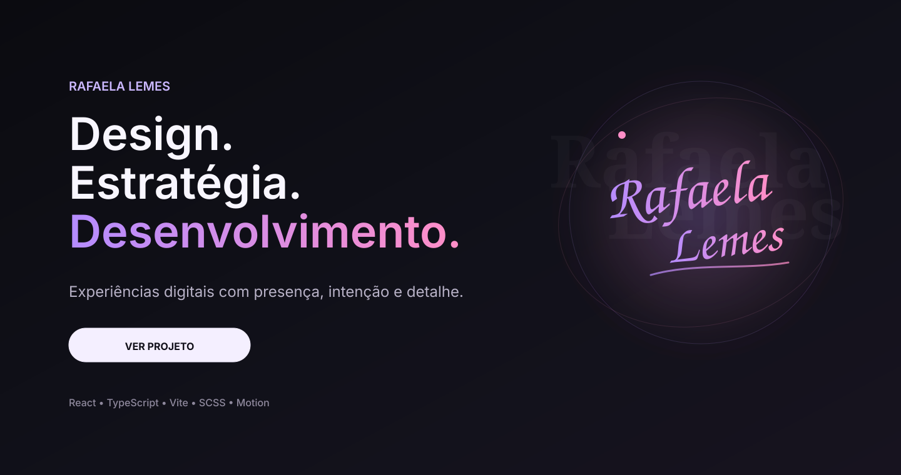

<br>

# Rafaela Lemes — Portfolio

### Uma experiência digital construída para comunicar valor antes da primeira conversa.

<br>


</div>

---

## Sobre o projeto

Em um cenário onde muitos portfólios digitais acabam seguindo a mesma fórmula, este projeto nasceu com uma ambição diferente: construir uma presença que fosse percebida antes mesmo de ser explicada.

Cada espaço, transição, contraste e gesto visual foi pensado para unir **clareza**, **sofisticação** e **intenção**. O resultado é um portfólio que não apenas apresenta serviços e projetos, mas traduz uma forma de trabalhar.

> Design não como decoração.  
> Desenvolvimento não como execução isolada.  
> Estratégia como ponto de partida.

---

## Experiência

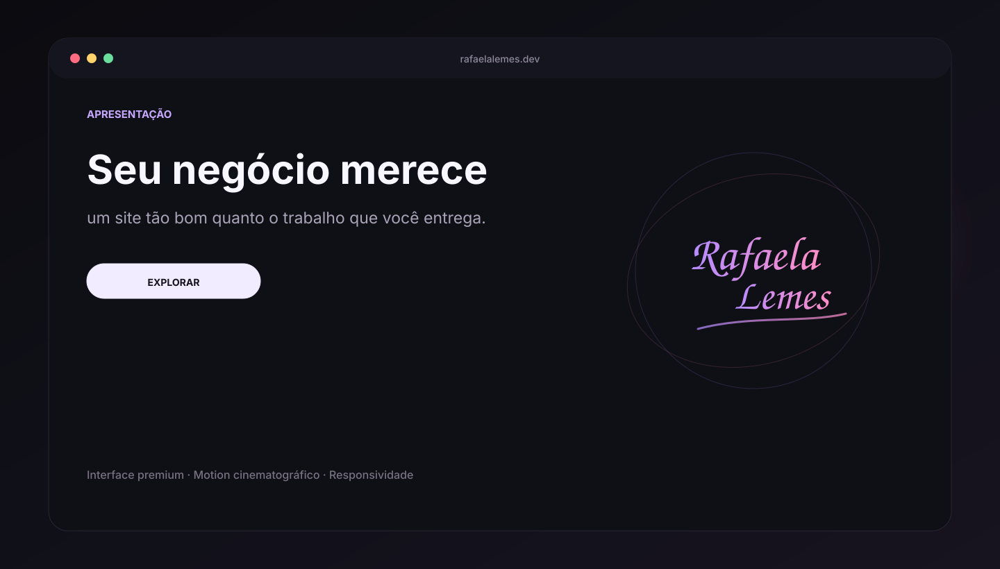

<br>

<table>
<tr>
<td width="50%">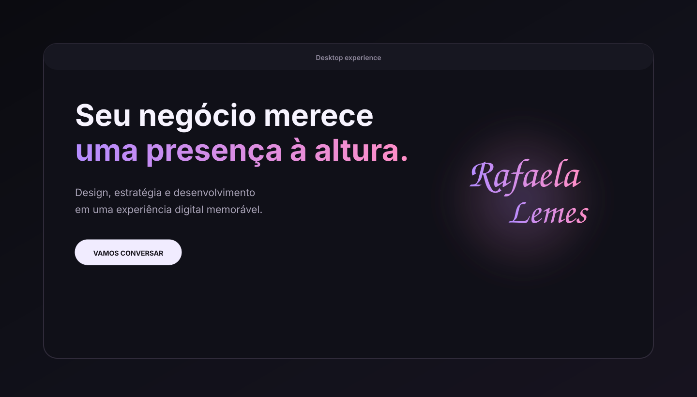</td>
<td width="50%">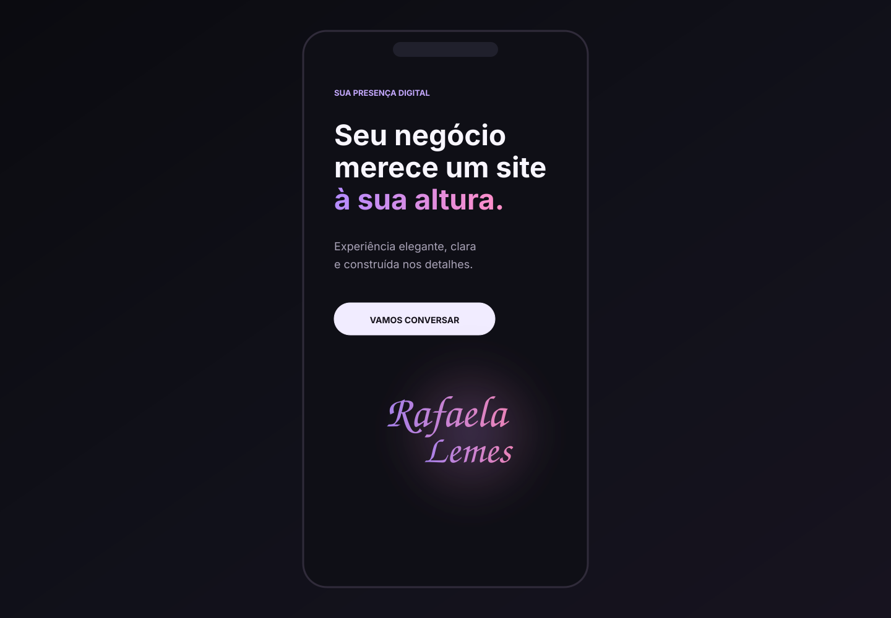</td>
</tr>
</table>

---

## Destaques

| Experiência                         | Engenharia                        |
| ----------------------------------- | --------------------------------- |
| Tema claro e escuro                 | React + TypeScript                |
| Assinatura visual exclusiva         | SCSS Modules                      |
| Motion cinematográfico              | Componentização escalável         |
| Replay de animações na viewport     | Tokens e variáveis CSS            |
| Pointer effects globais             | ESLint + Prettier                 |
| Responsividade cuidadosa            | Build com Vite                    |
| Respeito a `prefers-reduced-motion` | Estrutura preparada para evolução |

---

## Demonstração de movimento

<div align="center">
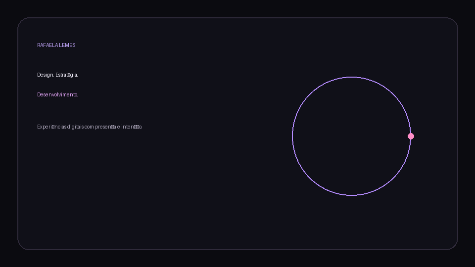
</div>

---

## Arquitetura

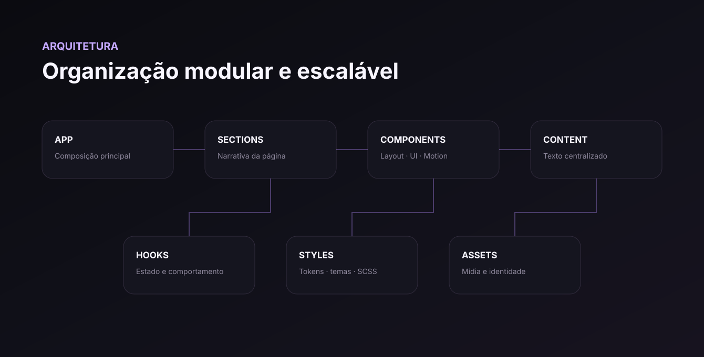

```text
src/
├── assets/
├── components/
│   ├── layout/
│   ├── motion/
│   └── ui/
├── content/
├── hooks/
├── sections/
├── styles/
├── utils/
├── App.tsx
└── main.tsx
```

A arquitetura separa responsabilidades com clareza:

- **Sections** constroem a narrativa da página.
- **Layout** define ritmo, largura e composição.
- **UI** reúne elementos reutilizáveis.
- **Motion** centraliza comportamento visual e animações.
- **Content** evita textos espalhados pelos componentes.
- **Styles** concentra tokens, temas e fundamentos globais.

---

## Motion System

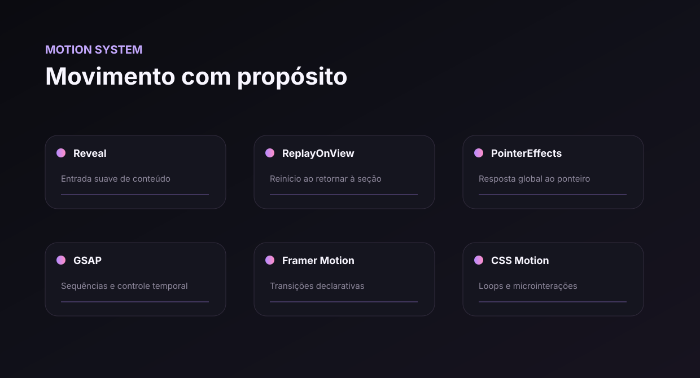

### `Reveal`

Responsável por entradas elegantes e previsíveis de conteúdo.

### `ReplayOnView`

Remonta o conteúdo animado quando a seção volta à viewport ou quando o tema muda. Isso permite que a experiência seja revisitada sem manter lógica duplicada dentro de cada seção.

### `PointerEffects`

Camada global de resposta ao ponteiro, isolada da apresentação e das seções de conteúdo.

### GSAP, Framer Motion e CSS

Cada ferramenta é usada onde entrega mais valor:

- **Framer Motion** para transições declarativas.
- **GSAP** para sequências e controle temporal.
- **CSS** para loops, órbitas e microinterações simples.

---

## Design System

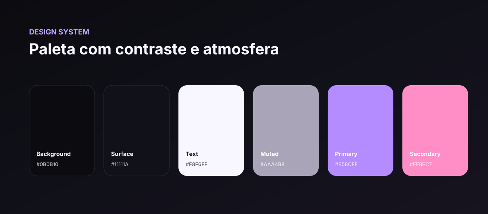

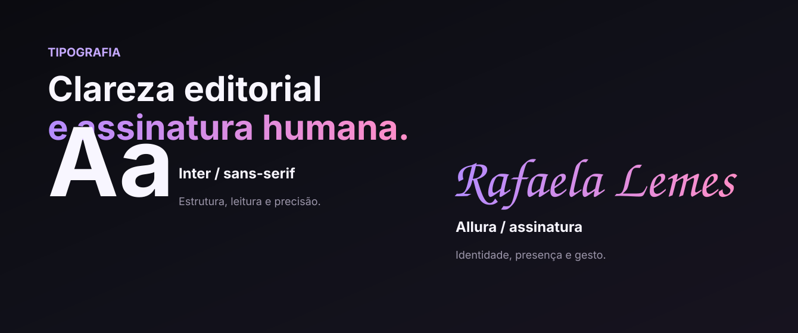

O sistema visual utiliza variáveis CSS para manter consistência entre temas, componentes e estados.

```scss
:root {
  --color-background: #0b0b10;
  --color-surface: #11111a;
  --color-text: #f8f6ff;
  --color-text-muted: #aaa4b8;
  --color-primary: #b58cff;
  --color-secondary: #ff8ec7;
}
```

> Os valores acima representam a direção visual do README. Substitua-os pelos tokens exatos do projeto caso sejam diferentes.

---

## Componentes

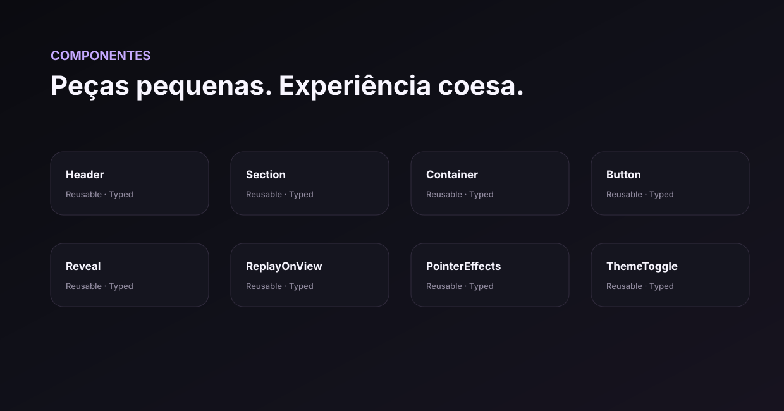

A interface é construída a partir de componentes pequenos, tipados e reutilizáveis. Isso reduz acoplamento e permite evoluir o projeto sem transformar cada nova seção em uma exceção.

---

## Acessibilidade e movimento reduzido

O projeto considera usuários que preferem uma experiência com menos movimento.

```scss
@media (prefers-reduced-motion: reduce) {
  /* animações decorativas são removidas */
}
```

Além disso, elementos puramente visuais são tratados com `aria-hidden`, a hierarquia de conteúdo preserva semântica e os estados de interação mantêm contraste e legibilidade.

---

## Performance

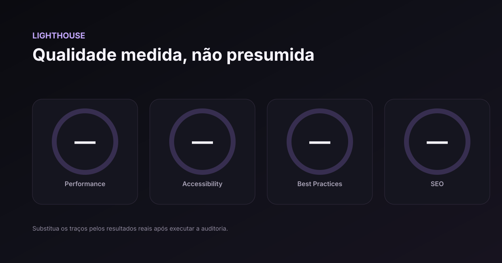

As métricas não foram inventadas neste README. Execute uma auditoria real antes de publicar valores:

```bash
npm run build
npm run preview
```

Depois, rode o Lighthouse no preview de produção e atualize o arquivo `docs/lighthouse.svg`.

---

## Executando localmente

```bash
git clone URL_DO_REPOSITORIO
cd site-rafaela
npm install
npm run dev
```

Build de produção:

```bash
npm run build
```

Preview local:

```bash
npm run preview
```

---

## Scripts

| Comando           | Ação                                   |
| ----------------- | -------------------------------------- |
| `npm run dev`     | Inicia o ambiente de desenvolvimento   |
| `npm run build`   | Gera o build de produção               |
| `npm run preview` | Executa o build localmente             |
| `npm run lint`    | Verifica padrões e problemas de código |

---

## Roadmap

- [x] Sistema de temas
- [x] Hero e assinatura animada
- [x] Prologue
- [x] Pointer effects globais
- [x] Replay de animações na viewport
- [x] Seções principais
- [x] Responsividade inicial
- [ ] Auditoria Lighthouse final
- [ ] Testes automatizados
- [ ] Internacionalização
- [ ] CMS ou camada de conteúdo
- [ ] Publicação e domínio final

---

## Galeria

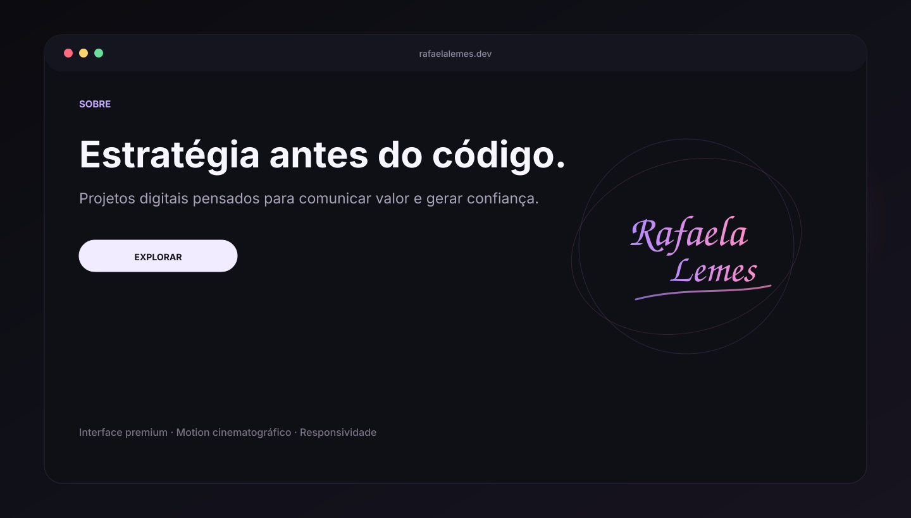

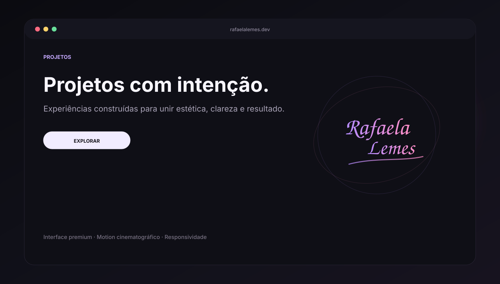

---

## Decisões técnicas

### Por que React e TypeScript?

Para construir uma base componentizada, previsível e segura, adequada à evolução contínua do portfólio.

### Por que SCSS Modules?

Para manter estilos próximos dos componentes sem abrir mão de nesting, organização, tokens e isolamento de escopo.

### Por que não concentrar toda animação em uma única biblioteca?

Porque cada tipo de movimento exige um nível diferente de controle. A escolha da ferramenta é feita pela necessidade, não pela preferência.

### Por que um sistema de replay?

Porque animações de apresentação não deveriam funcionar apenas na primeira visita. Ao retornar a uma seção, a narrativa visual pode começar novamente de forma controlada.

---

## Autoria

<div align="center">

### Rafaela Lemes

Design · Estratégia · Desenvolvimento

<br>

**Feito com intenção, precisão e atenção a cada detalhe.**

<br>

© 2026 Rafaela Lemes. Todos os direitos reservados.

</div>
